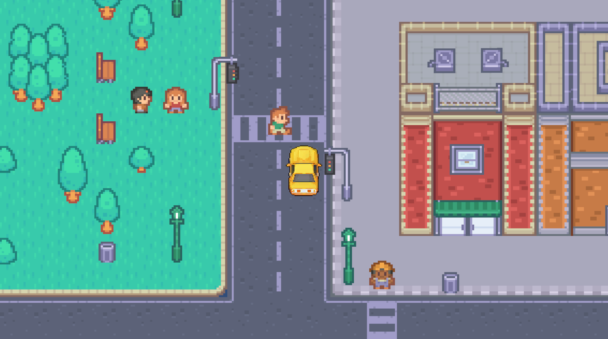

# CityDrive

This game is created for a **School Project** made in *Unity*, i will update this to a full "game" to learn and make a **Portfolio**.

Inspired by the first GTA games, top-down sandbox city driving while being chased by the police.

## Planned
- [ ] Fix movement and collisions.
- [ ] Fix animations, add more steps so it looks more clean.
- [ ] Add better animations and effects on collisions and destroyed vehicles.
- [ ] Add music and sound effects.
- [ ] Add better IA for the police, more cars as a Spawner and hive behavior.
- [ ] Expand map with more variety.
- [ ] Add patrol on police.
- [ ] Add collisions, IA and patrol to NPC.
- [ ] Add random events, car crash, ambulance, police chasing others.
- [ ] Add more cars, civil ones to make the city alive.
- [ ] Add special cars, like taxi or bus to interact with NPC.
- [ ] Add advanced IA for "panic" on NPC and Cars.
- [ ] Add paint shop to get your car painted.
- [ ] Add more cars as playable.
- [ ] Add a pause menú
- [ ] Add a wasted or game over scene.
- [ ] Add main menu.
- [ ] Add options menu.

## Credits

### Assets

- **Tileset Map:** [RPG Urban Kit by Kenney](https://kenney-assets.itch.io/rpg-urban-kit) | CC0 1.0 Universal
- **Vehicles:** [Pixel Vehicles - Top Down Game Assets by Minzinn](https://minzinn.itch.io/pixelvehicles) | Creative Commons Attribution v4.0 International

